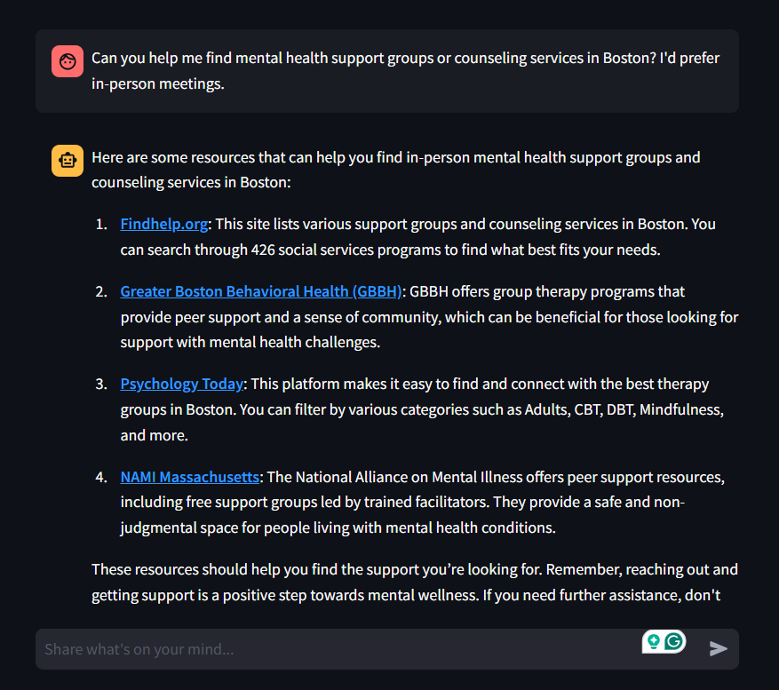
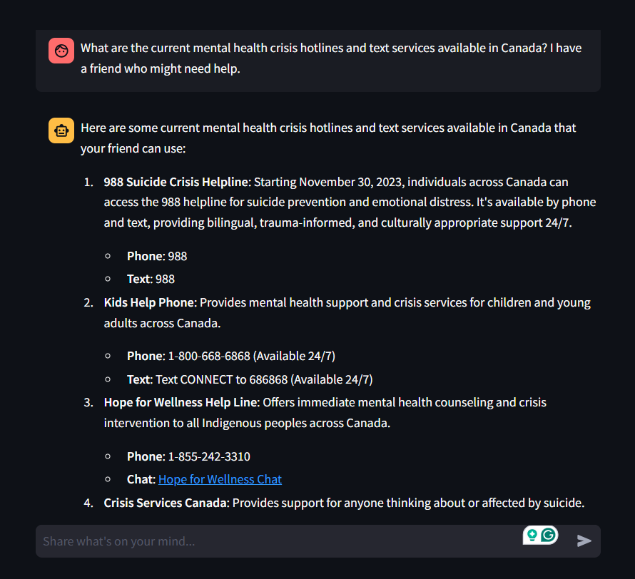
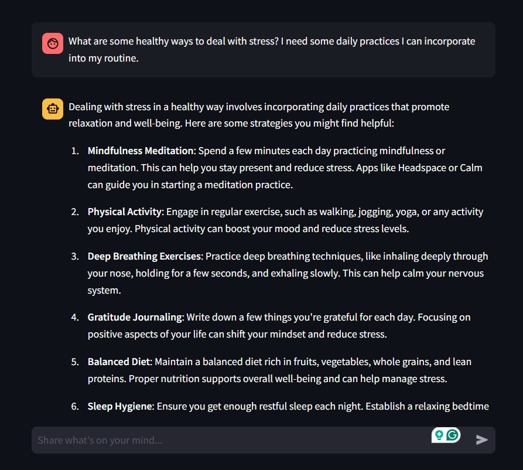
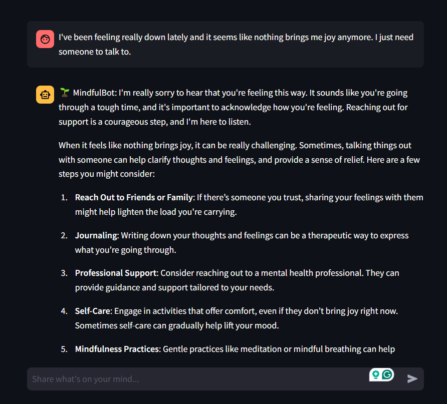

# MindfulBot: AI Mental Health Support Companion

## Overview

MindfulBot is an AI-powered assistant designed to provide emotional support and mental health resources. This chatbot leverages advanced language models to offer empathetic responses and helpful guidance while connecting users with professional mental health resources when needed. Using the Tavily search integration, MindfulBot can perform real-time web searches to provide up-to-date mental health resources and information.

## Features

- Provides supportive interactions for:
  - Anxiety and stress management
  - Depression and mood challenges
  - Emotional regulation
  - Sleep difficulties
  - Social connection challenges
  - Work-life balance
  - General mental wellness
- Real-time web search capabilities:
  - Finds current mental health resources
  - Locates local support services
  - Provides verified crisis hotline information
  - Accesses up-to-date mental health guidelines
- User-friendly chat interface
- Crisis support information
- Clear boundaries and professional referrals

## 🚀 Try the App

You can test the live app here: [MindfulBot](https://mentalhealth-support-bot-langchain.streamlit.app/)

## Quick Links

- [988 Suicide & Crisis Lifeline](https://988lifeline.org/)
- [NAMI Resources](https://www.nami.org/help)
- [Mental Health America](https://www.mhanational.org/)

## Sample Interactions

Here are some example conversations with MindfulBot:

| | |
|:-------------------------:|:-------------------------:|
| Boston Health Support Groups |   Health Crisis Hotlines Canada|
| Dealing with Stress |   Feeling Low|

## Technology Stack

MindfulBot is built using modern technologies for natural language processing:

- Backend:
  - Python
  - LangChain for LLM integration
  - OpenAI GPT-4 for natural language understanding
  - Tavily API for real-time web search capabilities
- User Interface:
  - Streamlit for creating the web-based chat interface
- Additional Features:
  - Real-time web search for up-to-date resources
  - Crisis protocol integration

## Setup

1. Create and activate conda environment:

```bash
conda create -n mental_health_bot python=3.10
conda activate mental_health_bot
```

2. Install requirements:

```bash
pip install -r requirements.txt
```

3. Run the application:

```bash
streamlit run app.py
```

## Usage


## Important Note

MindfulBot is designed to be a supportive tool, not a replacement for professional mental health care. Always seek professional help for serious mental health concerns. In case of emergency, contact your local emergency services or call/text 988 for immediate support.

## Disclaimer

While MindfulBot aims to provide support and resources, it is an AI assistant and should not be considered a substitute for professional mental health care. Always consult with qualified mental health professionals for personal medical advice.
